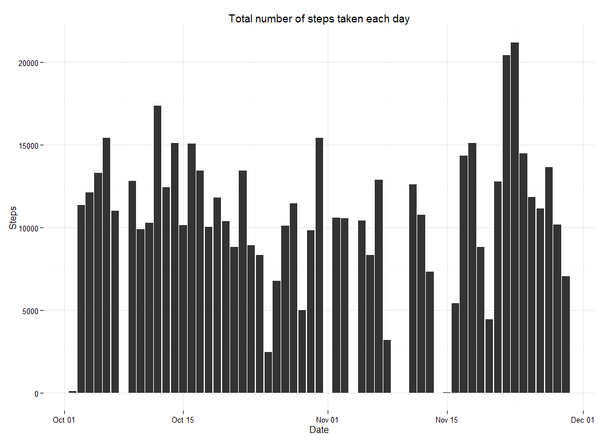
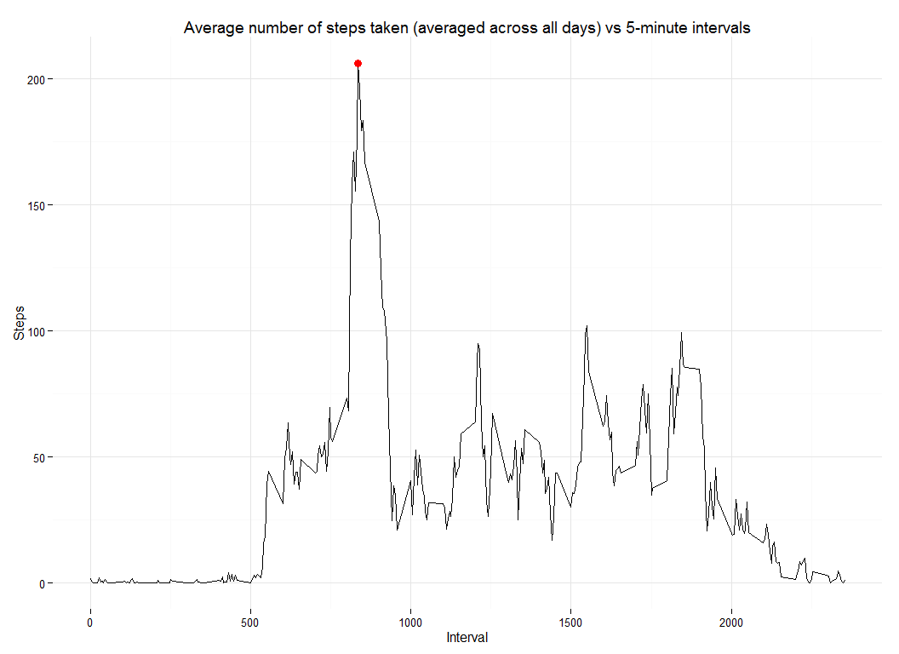
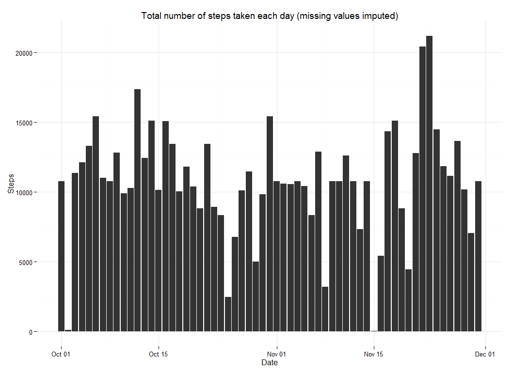
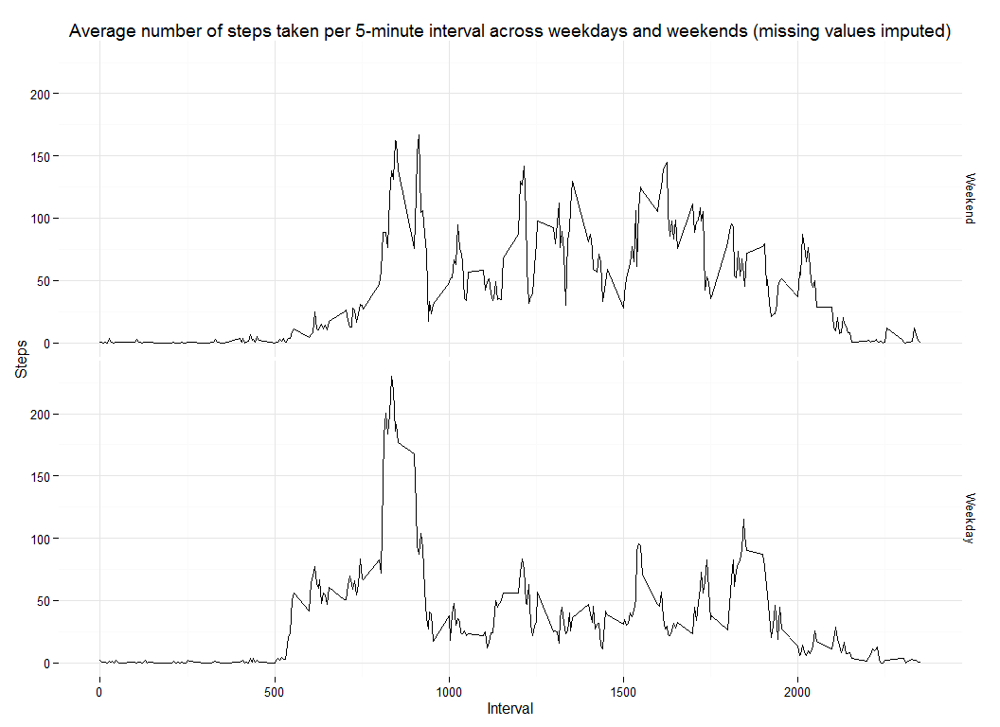

# Reproducible Research: Peer Assessment 1
## Synopsis
This report answers the questions posed for Assignment 1 of the Coursera - Reproducible Research course. Details of the assignment can be found at: https://class.coursera.org/repdata-035/human_grading/view/courses/975148/assessments/3/submissions.

## Loading and preprocessing the data
The following code is used to load the dataset into a data frame.

```r
# Load required libraries
library(dplyr)
```

```
## 
## Attaching package: 'dplyr'
## 
## The following objects are masked from 'package:stats':
## 
##     filter, lag
## 
## The following objects are masked from 'package:base':
## 
##     intersect, setdiff, setequal, union
```

```r
library(lubridate)

# First set the knitr global option to always output code chunks
knitr::opts_chunk$set(echo = TRUE, fig.width = 11, fig.height = 8)

setwd("c:/Users/Chris Lewkowski/Github/RepData_PeerAssessment1")


# Read in the data file, unzipping on the fly
activity_data <- read.csv(unz("activity.zip", "activity.csv"), header=TRUE)

# Data columns are steps, date, inverval
# Tidy up the data, convert the date into POSIXct format
activity_data <- activity_data %>%
  mutate(date_POSIX = ymd(date), interval_tidy = factor(gsub('^(.{2})(.*)$', '\\1:\\2', formatC(interval, width = 4, format = "d", flag = "0"))))
```


## What is mean total number of steps taken per day?
Firstly, a histogram of number steps by day is displayed to give an overall sense of the data.

```r
# Load required ggplot library
library(ggplot2)

# Plot the histogram of steps taken each day
g <- qplot(x = activity_data$date_POSIX, y = activity_data$steps, geom="histogram", stat="identity") +
  labs(title = "Total number of steps taken each day", x = "Date", y = "Steps") +
  theme_minimal()

# Calculate the mean and median
m <- group_by(activity_data, date) %>%
  summarise(daily_steps = sum(steps, na.rm = TRUE)) %>%
  summarise(mean = mean(daily_steps), median = median(daily_steps))

print(g)
```

```
## Warning: Removed 2304 rows containing missing values (position_stack).
```

 

The mean of the average daily total steps is 9354.2295082 and the median is 10395. Note that NA values have been dropped when deriving these calculations.

## What is the average daily activity pattern?
The next plot shows how the activity for each 5 minute period 

```r
# First need to group the data by interval and calulate the mean
# number of steps for each interval
m <- group_by(activity_data, interval) %>%
  summarise(mean_steps = mean(steps, na.rm = TRUE))

m <- as.data.frame(m)

# Calculate the interval with the Maximum total average number of steps
interval_max_steps <- which.max (m$mean_steps)

# Select the row containing the interval with maximum steps
max_steps <- subset(m, interval == m$interval[interval_max_steps])

# Code to plot the histogram
g <- ggplot(m, aes(interval, mean_steps )) +
  geom_line() +
  geom_point(data=max_steps, colour="red", size = 3) +
  labs(title = "Average number of steps taken (averaged across all days) vs 5-minute intervals", x = "Interval", y = "Steps") +
  theme_minimal()

print(g)
```

 

The interval with maximum total average steps of: 206.17 occurs at interval: 835 in the morning.

## Imputing missing values
The data contain missing values that could have biased the previous interpretations. 

```r
# Calculate the number of rows containing NA values in the dataset
step_nas <- is.na(activity_data$steps)
total_nas <- sum(step_nas)
```
There are 2304 rows containing NA values.

The strategy used to correct the NA values will replaces all NA step values with the average total steps for the same interval from the days that contain a value for steps. The code below creates a new dataset **activity_data_complete** that has been modified using this strategy.

```r
# Make a copy of the dataset
activity_data_complete <- activity_data

# Fill in missing (NA) steps with the average total steps for the same interval (calculated from the  previous step and in the m dataset)
for (i in 1:nrow(activity_data_complete))
{
  if (is.na(activity_data_complete$steps[i]))
  {
    activity_data_complete$steps[i] <- m$mean_steps[which(m$interval == activity_data_complete$interval[i])]
  }
}

# Plot the histogram of steps taken each day
g <- qplot(x = activity_data_complete$date_POSIX, y = activity_data_complete$steps, geom="histogram", stat="identity") +
  labs(title = "Total number of steps taken each day (missing values imputed)", x = "Date", y = "Steps") +
  theme_minimal()

# Calculate the mean and median
m <- group_by(activity_data_complete, date) %>%
  summarise(daily_steps = sum(steps, na.rm = TRUE)) %>%
  summarise(mean = mean(daily_steps), median = median(daily_steps))

# Print the graph
print(g)
```

 

The mean of the average daily total steps is 1.076619\times 10^{4} and the median is 1.076619\times 10^{4}.

## Are there differences in activity patterns between weekdays and weekends?
Yes. Both weekday and weekend activity are similar between approx. 08:00 and 09:00, although weekday activity starts around 05:30 where the weekend increase from around 07:00. Weekdays are less active between 09:00 and 18:00, whereas weekends are more active throughout the day. Both periods tail off around 21:30. This can be seen in the graph below.

```r
# Calculate the weekends and create a new column to indicate this 
activity_data_complete <- activity_data_complete %>%
  mutate( weekend = factor(weekdays(date_POSIX) %in% c("Saturday", "Sunday"), levels = c(TRUE, FALSE), labels = c("Weekend", "Weekday")))

# Group by interval and weekend or not
m <- group_by(activity_data_complete, weekend, interval) %>%
  summarise(mean_steps = mean(steps, na.rm = TRUE))

# Code to plot the histogram
# Code to plot the histogram
g <- ggplot(m, aes(interval, mean_steps )) +
  geom_line() +
  labs(title = "Average number of steps taken per 5-minute interval across weekdays and weekends (missing values imputed)", x = "Interval", y = "Steps", legend = "Period") +
  facet_grid(weekend ~ .) +
  theme_minimal()

print(g)
```

 
